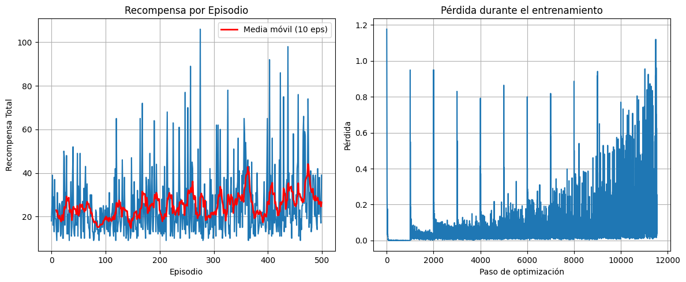
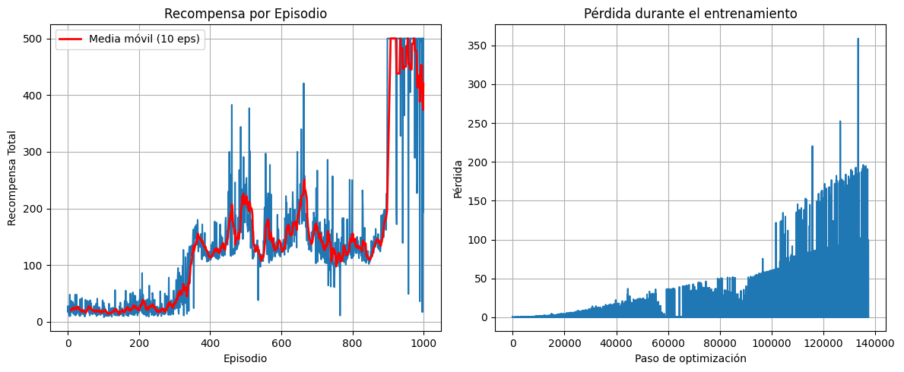

# CartPole_DL
El objetivo de este ejercicio es entrenar a un agente para que equilibre un poste en un carro (cartpole) en movimiento durante el mayor tiempo posible. Se deberá usar Deep Q-Learning (DQL) con una red objetivo para lograr esto.
Implementación de Deep Q-Learning con red objetivo para resolver el problema de equilibrio de poste en CartPole utilizando PyTorch y Gymnasium.

## Requisitos

```bash
pip install torch gymnasium numpy matplotlib
```

## Configuración de Hiperparámetros

### Modelo 1 - Entrenamiento Inicial
```python
# Hiperparámetros principales
GAMMA = 0.99
LR = 1e-3
BATCH_SIZE = 64
REPLAY_CAPACITY = 50_000
TARGET_UPDATE_FREQ = 1000
MAX_EPISODES = 500

# Exploración ε-greedy
EPS_START = 1.0
EPS_END = 0.05
EPS_DECAY_STEPS = 50_000
```

### Modelo 2 - Entrenamiento Optimizado
```python
# Hiperparámetros principales
GAMMA = 0.99
LR = 5e-4
BATCH_SIZE = 64
REPLAY_CAPACITY = 50_000
TARGET_UPDATE_FREQ = 1000
MAX_EPISODES = 1000

# Exploración ε-greedy
EPS_START = 1.0
EPS_END = 0.01
EPS_DECAY_STEPS = 15_000
```

## Resultados

### Modelo 1 - Subentrenado



El Modelo 1 alcanzó una recompensa promedio de 40-45 después de 500 episodios, mostrando mejora gradual pero sin convergencia completa. La pérdida aumentó hasta >1.0 de manera inestable, y el epsilon final de ~0.70 indica exploración excesiva. La alta variabilidad entre episodios (10-110 recompensas) refleja falta de consolidación de la política aprendida.

### Modelo 2 - Completamente Entrenado



El Modelo 2 logró convergencia óptima alcanzando 500 recompensas (máximo teórico) de manera consistente a partir del episodio 900. Las modificaciones en hiperparámetros (learning rate reducido, decay de epsilon acelerado, y duplicación de episodios) permitieron un aprendizaje estructurado en cuatro fases, culminando en una política robusta y estable que resuelve la tarea completamente.

## Análisis Comparativo

La comparación entre modelos demuestra que ajustes mínimos en hiperparámetros producen impactos dramáticos: reducir el learning rate a la mitad (5e-4) eliminó inestabilidades, acelerar el epsilon decay tres veces (15,000 pasos) permitió mejor explotación del conocimiento, y duplicar los episodios dio tiempo suficiente para convergencia. El Modelo 2 superó al Modelo 1 en 11x el rendimiento promedio, confirmando que la implementación del algoritmo era correcta desde el inicio y solo requería calibración adecuada.

## Estructura del Proyecto

```
├── cartpole.ipynb              # Notebook principal con implementación
├── README.md                   # Este archivo
├── modelo1_resultados.png      # Gráficas de resultados
└── modelo2_resultados.png      # Gráficas de resultados
```

## Autores

- Fabiola Contreras, 22787
- Diego Duarte, 22075
- José Marchena, 22398
- Sofía Velásquez, 22049
- María José Villafuerte, 22129